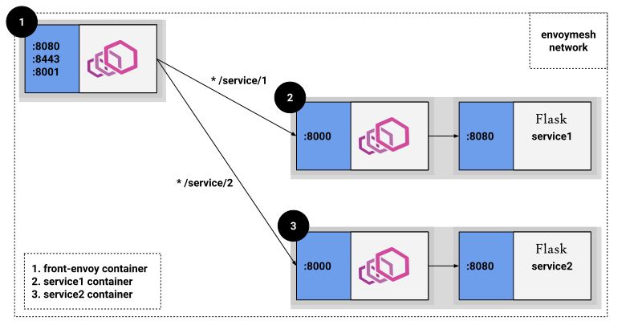

# tw_cicd_demo
demo cicd by github + travis

## 一键启动脚本

首次安装执行脚本: `sudo bash requick_start.sh`

## 程序说明

1. 简单的web应用
2. 部署方案使用: `docker` / `docker-compose`
3. 应用使用 service mesh 架构模型, 使用开源envoy组件即sidecar方式进行部署, 实现简单的流量代理,负载均衡,断融,服务发现 等功能, 
4. docker-compose 用来重启, 暂停
    - docker-compose restart restart
    - docker-compose down
    - docker-compose up --build -d 
5. Network topology ：

   
## 关于生成环境部署方案
### 一.CICD部署
考虑使用：`gitlab` + `k8s` + `harbor` + `jenkins` + `ELK` + `Helm`, 流程如下
   
1. 提交代码到 Gitlab 代码仓库
2. 通过 Gitlab 配置的 Jenkins Webhook 触发 Pipeline 自动构建
3. Jenkins 触发构建构建任务，根据 Pipeline 脚本定义分步骤构建
4. 先进行代码静态分析，单元测试
5. 然后进行项目 构建
6. 根据构建结果构建 Docker 镜像
7. 推送 Docker 镜像到 Harbor 仓库
8. 触发更新服务阶段，使用 Helm 安装/更新 Release
9. 查看服务是否更新成功
10.监控使
   
### 二. 日志，性能监控
1. 日志服务获取k8s集群相关日志，提供日志,使用ELK工具快速定位告警位置
2. k8s上配置上告警测试，出现问题及时通知运维/开发人员， 可绑定邮箱，钉钉进行告警触发

### 三. 公有云部署
1. 根据各自公有云产品进行合理选择，比如 Aliyun，可以使用ASK代替自建k8s集群（Serverless 容器服务）
   - 优势： 快捷且省费用，用户无需创建任何节点即可开始部署容器实例，自带高可用、无需考虑扩容问题、不用手动编写yaml文件、不用自建ingress、不用自建ceph类存储等；并且在安全、权限管控、事件日志等都有完事的功能。
   - 创建ASK时勾选自动创建日志服务SLS，代替自建ELK等日志收集平台
   

